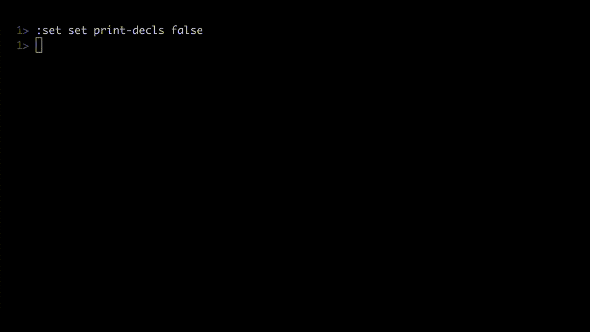

# swift-tqdm

This is Swift port of the well known and awesome Python package [`tqdm`](https://github.com/tqdm/tqdm). 
It allows you to add a fancy progress bar to your loops with minimal effort.
It has common features of the original package.



## Installation

You can add this package as a dependency of your product with the code snippet below in `Package.swift` of your project:

```swift
let Package = Package(
        name: "MyAwesomePackage",
        // ...
        dependencies: [
            .package(url: "https://github.com/ebraraktas/swift-tqdm.git", from: "0.1.2"),
            // ...
        ],
        // ...
        targets: [
            .target(name: "MyAwesomeTarget",
                    dependencies: [.product(name: "Tqdm", package: "swift-tqdm")])]
)
```

## Usage

The package allows 2 usage scenarios:

### Wrapping a `Sequence`

You can wrap your `Sequence` and iterate over `TqdmSequence`. 
This way, you will be printing progress bar while iterating. See example below. 

```swift
import Tqdm
var sum = 0
let N = 1000
// Iterate over sequence and print progress bar
for i in TqdmSequence(sequence: 0..<N) {
    sum += i
}
```

### Updating manually

If you need to update progress bar with different increments or under some conditions,
you can use `update(n: Int)` method of the `Tqdm` object. You can also print messages using
`write(message: String)` method. See example below.

```swift
import Tqdm
let N = 500
let tqdm = Tqdm(description: "swift-tqdm", total: N, color: .red)
for i in 0..<N {
    Thread.sleep(forTimeInterval: 0.005) // Simulate work
    // Update bar
    tqdm.update() // Increment iteration by 1 
    // tqdm.update(n: 3) // Increment iteration by 3
    if i == (N / 2) {
        // Print without overlap with the bar
        tqdm.write("Half of the job is done") 
    } 
}
tqdm.close()
```

You can observe [`TqdmExample`](Sources/TqdmExample) executable to see other options. 

## Parameters

Both `Tqdm` and `TqdmSequence` has other parameters which let you control behavior of the progress bar. 
Most of the parameters are same, except `Tqdm` accepts `total: Int?` while `TqdmSequence` accepts `sequence : S`.

- __sequence¹:__ `Sequence` to be wrapped and iterated over
- __description:__ Progress bar description before actual bar
- __total²:__ The number of expected iterations. If unspecified only basic progress
 statistics are displayed (no ETA, no progressbar).
- __columnCount:__ Total column count of the output
- __minInterval:__ Minimum progress display update interval (default: `0.1`) seconds.
- __minIterations:__ Minimum progress display update interval, in iterations.
- __ascii:__ If unspecified or False, use unicode (smooth blocks)
  to fill the meter. The fallback is to use ASCII characters `" 123456789#"`
- __unit:__ String that will be used to define the unit of each iteration (default: `"it"`)
- __unitScale:__ If True, the number of iterations will be reduced/scaled
         automatically and a metric prefix following the
         International System of Units standard will be added
         (kilo, mega, etc.) (default: `false`)
- __smoothing:__ Exponential moving average smoothing factor for speed.
Ranges from 0 (average speed) to 1 (current/instantaneous speed) (default: `0.3`).
- __initial:__ The initial counter value. Useful when restarting a progress bar (default: `0`)
- __unitDivisor:__ (default: `1000`), ignored unless `unitScale` is `true`
- __color:__ Output color. It colorizes whole output, not just the bar like the Python equivalent does.
  
1: Only in `TqdmSequence`

2: Only in `Tqdm`

## Contributions

All source code is hosted on [GitHub](https://github.com/ebraraktas/swift-tqdm). Contributions are welcome.
To contribute code, [fork](https://help.github.com/articles/fork-a-repo/)
the [repository](https://github.com/ebraraktas/swift-tqdm) and open a
[pull request](https://github.com/ebraraktas/swift-tqdm/pulls).

To report bugs, propose features, or raise miscellaneous issues, create an
issue in the [issue tracker](https://github.com/ebraraktas/swift-tqdm/issues).

## License

Code is licensed under MIT License.
